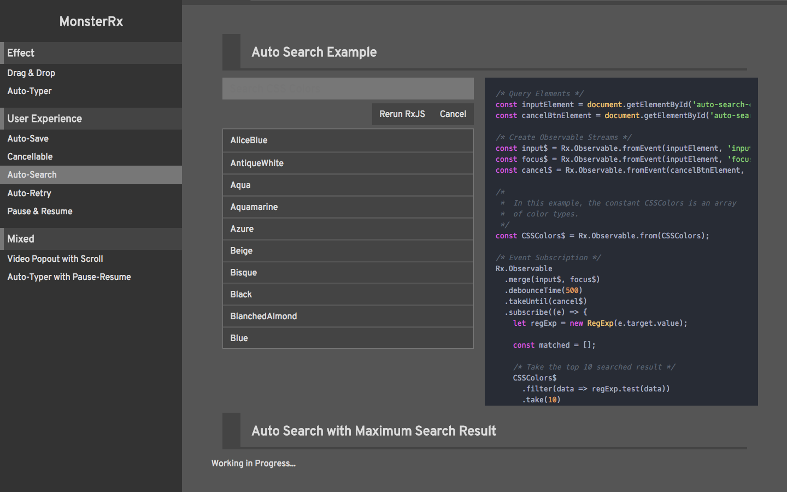

# MonsterRX - Collection of UX Examples Using RxJS


## About


This project aims at learning RxJS from a series of example to realize different kind of UX application. You can clone it down, and following the instruction to open this page and play around with the code.

```
$ git clone git@github.com:Maxwell-Alexius/MonsterRX.git
```

Go into the project folder and run:

```
$ yarn install
$ yarn start
```

Navigation to the `http://localhost:3000` then well done!
